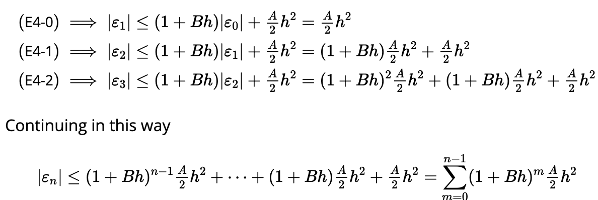
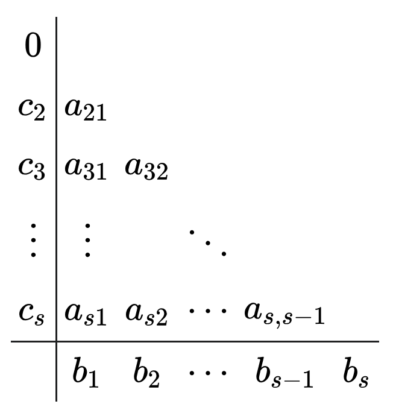
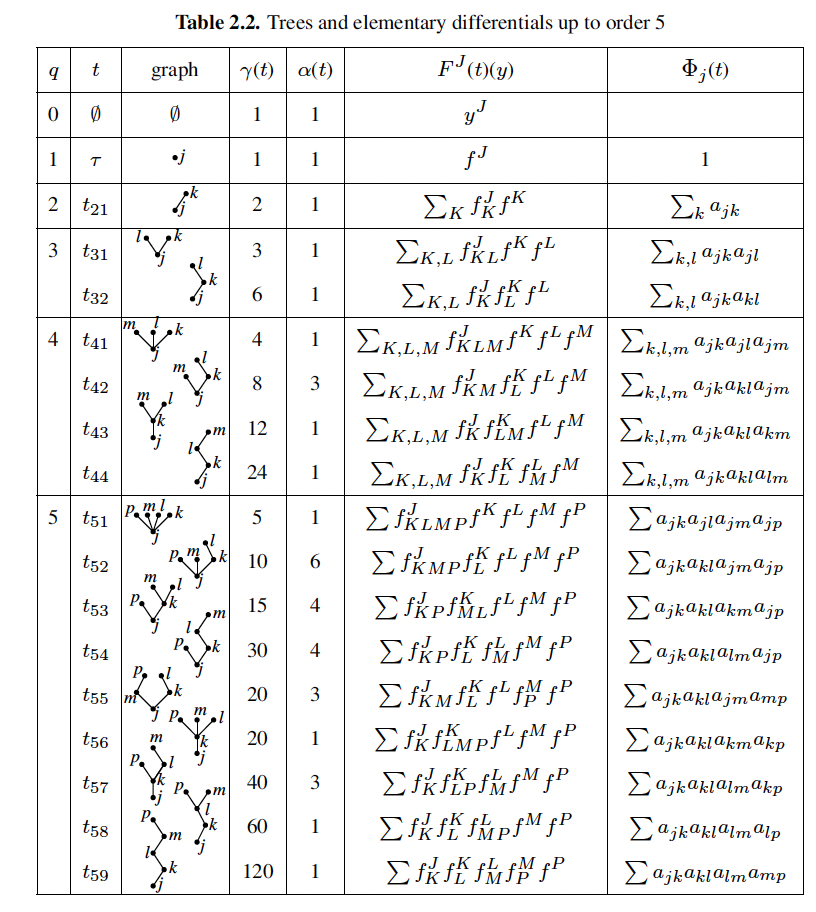
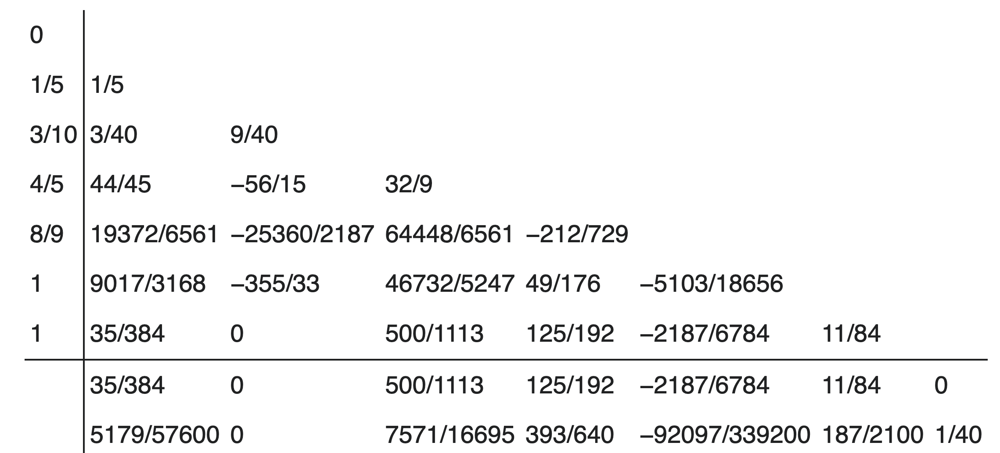
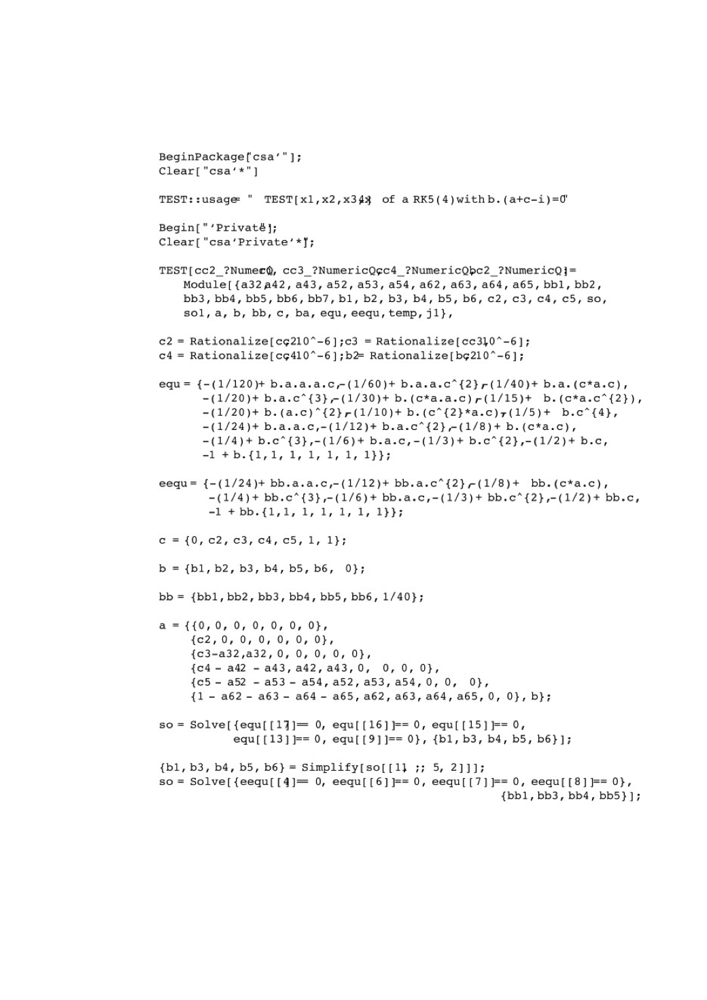
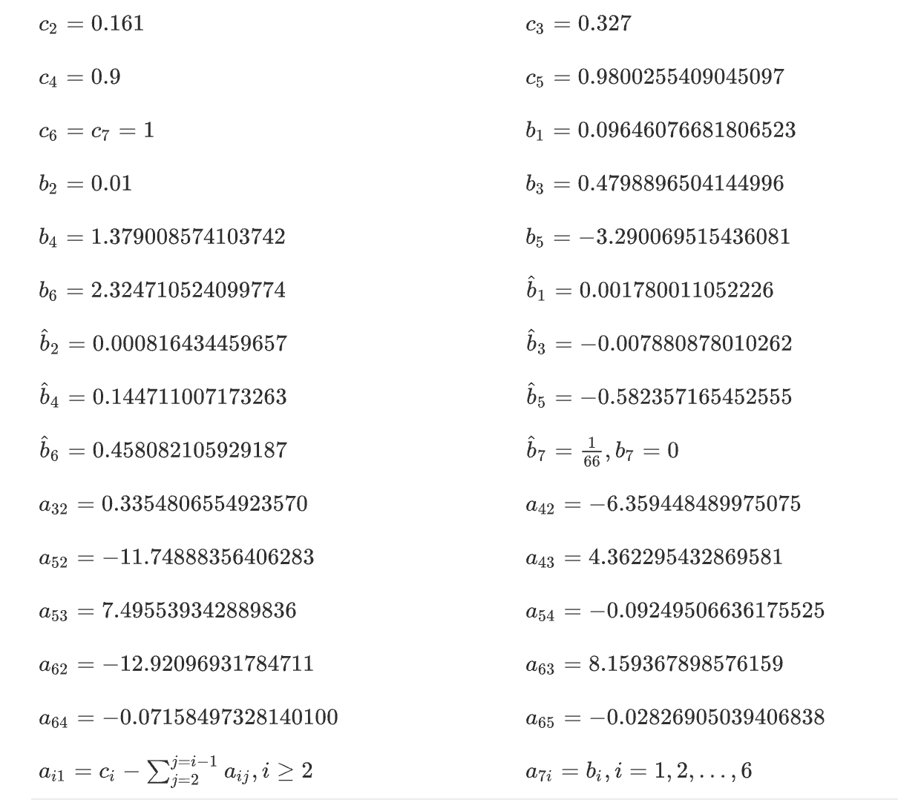

# Solvers for Non-Stiff Ordinary Differential Equations

In this lecture we will set the basis for solving ordinary differential equations (ODE). In order to build up the topic step-by-step, we will walk through the complete details of a non-stiff ODE solver, using this as a basis to then describe the more advanced techniques added to a stiff ODE solver and thus a solver for differential-algebraic equations (DAEs). This discussion will also demonstrate the close mathematical relationship between stiff ODEs and DAEs, the similarities but also the differences.

## Euler's Method for ODEs

As a starting point, let's do a full analysis of solving ODEs with Euler's method. Given an ODE of the form:

```math
u' = f(u,p,t)
```

where ``u(t_0) = u_0`` is known, to solve this equation on a time span from ``t \in [t_0, t_f]`` is known as the Initial Value Problem (IVP). The most basic method for handling this type of equation is known as Euler's method, which is given by the linear approximation of the derivative. Let ``u_n`` be the numerical approximation to ``u(t_0 + nh)`` at time ``t_n = t_0 + nh`` where ``h`` is the time discretization size, then can approximate via a Taylor Series expansion:

```math
u(t+(n+1)h) = u(t+nh) + h u'(t+nh) + \frac{1}{2}h^2 u''(t) + \mathcal{O}(h^3)
```

which motivates the approximation by dropping the higher order terms:

```math
u_{n+1} = u_n + h f(u_n,p,t_n)
```

which is Euler's method.

### Linear Stability of Euler's Method

The linear stability of a numerical method for ODEs is the maximum ``h`` such that the solution of ``u' = \lambda u`` converges ``t \rightarrow 0``. For the true equation, ``u' = \lambda u`` implies that ``u(t) = u_0 exp(\lambda t)`` and thus the solution converges to 0 iff ``\lambda < 0``.

Now let's see if Euler's method has similar behavior. To calculate this, plug in the test equation into Euler's method:

```math
u_{n+1} = u_n + h f(u_n, p, t_n)
```
```math
u_{n+1} = u_n + h \lambda u_n
```
```math
u_{n+1} = (1+h\lambda) u_n
```

If we let ``z = h \lambda``, then we have the difference equation:

```math
u_{n+1} = (1+z) u_n
```
```math
u_{n+1} = (1+z)^n u_0
```

Therefore this equation converges to zero if and only if ``\Vert 1+z \Vert < 1``. In the complex plane, this corresponds to the unit circle centered around 1. Importantly, for any equation with ``\lambda < 0`` such that ``\Vert 1 + h \lambda \Vert > 1``, we have that the numerical diverges to infinity while the true solution converges to zero!

### Measures of Error in Euler's Method: Local Truncation Error

The local truncation error, i.e. the largest error term in each given step, is one of the most important aspects of a numerical ODE solver. To calculate this, assume that ``u_n`` is exact. Then the LTE is the difference between the true solution ``u(t+(n+1)h)`` and ``u_{n+1}``. To calculate this, we can simply refer back to the Taylor series expansion:

```math
u(t+(n+1)h) = u(t+nh) + h u'(t+nh) + \mathcal{O}(h^2)
```
```math
LTE = u(t+(n+1)h) - u_{n+1}
```
```math
LTE = (u(t+nh) + h u'(t+nh) + \mathcal{O}(h^2)) - (u_n + h f(u_n,p,t_n))
```
```math
LTE = (u(t+nh) + h u'(t+nh) + \frac{1}{2}h^2 u''(t) + \mathcal{O}(h^3)) - (u(t+nh) + h u'(t+nh))
```
```math
LTE = \frac{1}{2}h^2 u''(t) + \mathcal{O}(h^3)
```

### Global Truncation Error in Euler's Method

The global truncation error is the error in a full integration. Abusing notation a bit and letting ``u(t+nh)`` be the true solution at time ``t+nh``, we can calculate this as:

```math
E_{n+1} = u(t+(n+1)h) - u_{n+1}
```

```math
E_{n+1} = u(t+(n+1)h) - (u_{n} + h f(u_n,p,t_n))
```

```math
E_{n+1} = (u(t+nh)-u_{n}) + (u(t+(n+1)h) - u(t+nh) - hf(u(t+nh),p,t_n)) + (hf(u(t+nh),p,t_n) - h f(u_n,p,t_n))
```

Notice that the first term is the global error at time step ``n`` while the second term is simply the LTE at time step ``n``, and thus we can simplify:

```math
E_{n+1} = E_n + LTE_n + (hf(u(t+nh),p,t_n) - h f(u_n,p,t_n))
```

If we assume that the derivatives are bounded, in particular: 

```math
u''(t) \leq A
``` 

over the domain of interest, then by the Taylor Series Remainder Theorem:


We can bound the error in the rest of the LTE terms using the maximum of the second derivative, and thus:

```math
LTE_n \leq \frac{1}{2} A h^2
```

For the final term, we use the mean-value theorem:

```math 
|f(u(t+nh),p,t_n) - f(u_n,p,t_n)| = |\frac{\partial f(u^\ast, p, t_n)}{\partial u}| |u(t+nh)-u_n|
```

We use assume the first partial derivative is bounded over the domain of interest:

```math
\frac{\partial f(u^\ast, p, t_n)}{\partial u} \leq B
```

and thus

```math 
|f(u(t+nh),p,t_n) - f(u_n,p,t_n)| \leq B E_n
```

Substituting all of this together we get:

```math
|E_{n+1}| \leq |E_n| + \frac{1}{2} A h^2 + h B |E_n|
```

```math
|E_{n+1}| \leq (1+Bh)|E_n| + \frac{1}{2} A h^2
```

Some manipulations later...



You get that ``E_n`` is bounded by a geometric series and use the analytical solution to a geometric series to get:

```math
|E_n| \leq \frac{A}{2B}[(1+Bh)^n - 1]h
```

Finally, notice:

```math
1+Bh \leq 1 + Bh + \frac{1}{2} (Bh)^2 + \frac{1}{3!} (Bh)^3 + \ldots = e^{Bh}
```

and therefore:

```math
|E_n| \leq \frac{A}{2B}[e^{Bhn} - 1]h
```

From this we can see that ``|E_n| \rightarrow 0`` as ``h \rightarrow 0``.

### General Points About the Global Truncation Error

The key factor is that while the leading term of the local truncation error has a nice and clean formula and the global error is related to this LTE, the global error requires propagation of each LTE into the next stage and thus has a compounding factor. Even with that, we can still bound the global error to ensure convergence as ``h \rightarrow 0``, but only if:

1. Derivatives one order beyond the order of the method are bounded.
2. The local truncation error converges to zero
3. The partials of `f` are bounded.

While this proof can be relaxed to remove some of the required bounding, these are general points to note which are exploited by most solvers. You need the derivatives defined in order for the solvers to work well, and the higher order method you use the higher derivatives you need bounds for. 

## Going Beyond Euler's Method

### The Midpoint Method

We can use this analysis to extend our methods to higher order approximation
by simply matching the Taylor series to a higher order. Intuitively, when we
developed the Euler method we had to make a choice:

$$u_{n+1} = u_n + h f(u,p,t)$$

where do we evaluate $f$? One may think that the best derivative approximation
my come from the middle of the interval, in which case we might want to evaluate
it at $t + \frac{h}{2}$. To do so, we can use the Euler method to
approximate the value at $t + \frac{h}{2}$ and then use that value to
approximate the derivative at $t + \frac{h}{2}$. This looks like:

```math
k_1 = f(u_n,p,t)\\
k_2 = f(u_n + \frac{h}{2} k_1,p,t + \frac{h}{2})\\
u_{n+1} = u_n + h k_2
```

which we can also write as:

```math
u_{n+1} = u_n + h f(u_n + \frac{h}{2} f_n,p,t + \frac{h}{2})
```

where $f_n = f(u_n,p,t)$. If we do the two-dimensional Taylor expansion we get:

```math
u_{n+1} = u_n + h f_n + \frac{h^2}{2}(f_t + f_u f)(u_n,p,t)\\
+ \frac{h^3}{6} (f_{tt} + 2f_{tu}f + f_{uu}f^2)(u_n,p,t)
```

which when we compare against the true Taylor series:

```math
u(t+h) = u_n + h f(u_n,p,t) + \frac{h^2}{2}(f_t + f_u f)(u_n,p,t)
+ \frac{h^3}{6}(f_{tt} + 2f_{tu} + f_{uu}f^2 + f_t f_u + f_u^2 f)(u_n,p,t)
```

and thus we see that

```math
u(t + h) - u_n = \mathcal{O}(h^3)
```

### General Runge-Kutta Methods

However, this idea gives rise to a more general scheme for approximating ODEs. The general form is to use previous derivative information to construct an approximation to some value ``u(t+ch)``, then using this new value to approximate a new derivative, and thus construct a better approximation ``u(t+c_2 h)``, and so on. Then using each of these sub-interval approximations we can approximate the final time point.

In mathematical terms, this type of scheme can be written as:

```math
k_1 = f(u_n,p,t_n)
```
```math
k_2 = f(u_n + h a_{11} k_1,p,t_n + c_2 h)
```
```math
k_3 = f(u_n + h a_{21} k_1 + a_{22} k_2, p, t_n + c_3 h)
```
```math
\vdots
```
```math
u_{n+1} = u_n + h(b_1 k_1 + b_2 k_2 + \ldots + b_s k_s)
```

where ``s`` is the number of stages. In this schema, the Euler method is simply the one-stage method, while the Midpoint method is the schema with ``c_1 = 0``, ``c_2 = \frac{1}{2}``, ``a_{11} = \frac{1}{2}``, and ``b_1 = 0``, ``b_2 = 1``. 

This class of methods is known as the Runge-Kutta methods and the set of coefficients ``(a_{ij}, b_i, c_i)`` is known as the tableau. Normally these tableaus are represented in a table:



The order of the Runge-Kutta method is simply the number of terms in the Taylor
series that ends up being matched by the resulting expansion. For example, for
the 4th order you can expand out and see that the following equations need to
be satisfied:


### Note about Order Conditions

Since the number of terms in the Taylor series grows exponentially with each increase in the order, this is fairly difficult to write down and thus most people use tricks in order to represent the order conditions. We refer to Hairer I for more information on this process.


You basically make rooted trees and then they represent conditions.



It's complicated and not necessarily for understanding how the resulting methods are used.

### Note about stages and order

1st order (i.e. matching the first term of the Taylor series) can be achieved by Euler's method which is one stage. Second order can be achieved by the Midpoint method which is two stages. "The Runge-Kutta method", which is also known as the classic Runge-Kutta method is simply RK4 is a 4th order method which 
uses 4 stages:

```math
k_1 = f(u_n,p,t)\\
k_2 = f(u_n + \frac{h}{2} k_1,p,t + \frac{h}{2})\\
k_3 = f(u_n + \frac{h}{2} k_2,p,t + \frac{h}{2})\\
k_4 = f(u_n + h k_3,p,t + h)\\
u_{n+1} = u_n + \frac{h}{6}(k_1 + 2 k_2 + 2 k_3 + k_4)\\
```
It may seem wise to thus extrapolate that one can gain an order per `f` evaluation, but that is not the case. It turns out that the number of stages required starts to grow more than linearly after 4! With $p$ being the order, here's a table of known minimum orders:


Given the number of terms in the Taylor series expansion grows exponentially after the first order, this calculation is hard to do but is guaranteed to be larger than linear. However, as we will see later, the effect of better order is exponential, so this does not mean that fourth order is optimal!

## The Fundamental Tension in ODE Solvers

The fundamental tension in ODE solvers is a simple fact:

**The theoretical performance of ODE solvers is well-understood as ``h \rightarrow 0``, but the purpose of a good ODE solver is to choose an ``h`` as large as possible in order to achieve a given error tolerance.**

Let's disect this a bit. The goal of an efficient code for solving ODEs is to approximate the solution to ``u' = f(u,p,t)`` "as fast as possible". But since it's an approximation, an error tolerance always needs to be known, i.e. "Approximate the solution to ``u' = f(u,p,t)`` as fast as possible under the constraint that the solution is within TOL of the true solution". 

This statement has a major caveat. In order to know if we are within TOL of the true solution, we would need some measure of the error. As we saw in the discussion on Euler's method, even for the simplest of numerical methods for ODEs a complete formula for the error of the full solution is seemingly unobtainable. Thus in general the field has relaxed this constraint to instead be written as "Approximate the solution to ``u' = f(u,p,t)`` as fast as possible under the constraint that the solution the error of any given step is below TOL". In other words, we wish to build efficient numerical solvers where ``LTE \leq TOL``. 

In order to achieve "efficient", we thus wish to choose as large of an ``h`` as possible such that ``LTE \approx TOL``, since the larger ``h`` is, the less total steps are required to solve the equation. This brings up two questions:

1. What kinds of methods take the least amount of "work" for the smallest LTE?
2. How can we find ``h`` such that ``LTE \leq TOL``?

!!! note
    There are ways to build ODE solvers that control the global truncation error, but there is no open source software (nor widely used closed source software) which does this with Runge-Kutta methods for IVPs. This is a potential final project.

### A Bit of Mental Math Around Solver Work Calculations And Optimal Order

Note that for efficiency of (non-stiff) ODE solvers, we simplify the calculation of work to simply assume that the internals of the ODE solver are effectively free compute, and thus the cost of running the ODE solver can be approximated by the number of times ``f(u,p,t)`` is computed. For Runge-Kutta methods, the number of times ``f`` is computed in a step is the stage of the method. Thus as we increase the stage of the method, there is more compute required for a given stage, but in theory the error should be less, therefore allowing ``h`` to be larger and potentially requiring fewer steps.

To understand this balance a bit better, we note that order has an exponential effect on the error with respect to ``h``. For example, if a method is 4th order, then the LTE is ``\mathcal{O}(h^5)``, and thus if we change ``h`` to ``\frac{h}{2}``, we end up decreasing the error by a factor of ``\frac{1}{2^5} = \frac{1}{32}``. Thus, if going to a higher order does not require an exponential increase in the number of stages required (which it does not), in terms of efficiency then it may seem best to always use the highest order method that we can.

However, this fact must be balanced around two facts. The first is that this error estimate only holds as ``h \rightarrow 0``. As ``h`` grows, the other terms in the LTE approximation become non-negligible, and thus it becomes no longer guaranteed that a higher order method has a lower error than a lower order method! Secondly, the methods themselves have a maximum step size which is allowed due to the stability requirement on the ODE solver. Thus the ODE solver should have a high enough order in order to make use of the efficiency gains, but if the order is too high then the ``h`` will need to be artificially decreased in order to ensure stability and accurate error approximations, and therefore there is a "sweet spot" where the order is high but not too high.

In practice, this has empirically been found to be between 3-9, though this can be very dependent on two things. For one, it's dependent on the type of problem being solved since the larger the eigenvalues of the Jacobian, i.e. the approximation of the linear stability ``\lambda``, the smaller ``h`` which is allowed. Therefore, equations with larger eigenvalues in the Jacobain tend to be optimal with lower order methods. And the second point, the optimality is dependent on the choice of TOL, since the smaller the error tolerance the smaller ``h`` will be, and thus the higher order that will be efficient.

### LTE-Optimal Runge-Kutta Methods via Tableau Optimization

Let's take for granted that a two-stage Runge-Kutta method can at most be second order, i.e. can match only the second derivative term of the Taylor Series expansion exactly. This means that for any second order method with two-stages,

```math
k_1 = f(u_n,p,t_n)
```
```math
k_2 = f(u_n + h a_{11} k_1,p,t_n + c_2 h)
```
```math
u_{n+1} = u_n + h(b_1 k_1 + b_2 k_2)
```

we would have that:

```math
LTE = C h^3 u'''(t) + \mathcal{O}(h^4)
```

for some value of ``C(a_{11}, c_2, b_1, b_2)``. Thus we can consider a LTE-Optimal second order two-stage Runge-Kutta method as the tableau choice that minimizes ``C(a_{11}, c_2, b_1, b_2)``.

Similarly, for any number of stages ``s`` and order ``o``, the LTE-Optimal ``s``-stage ``o``th order method is the choice of tableau coefficients ``(a_{ij}, b_i, c_i)`` which minimizes:

```math
LTE = C h^{o+1} u^{(o+1)}(t) + \mathcal{O}(h^(o+2))
```

An equivalent statement to this problem is the following:

**Find the tableau coefficients ``(a_{ij}, b_i, c_i)`` such that the order conditions for order ``o-1`` are satisfied exactly, and the divergence from the order constraints ``o`` is minimal**

This is equivalent because "the order conditions for order ``o-1`` are satisfied exactly" is equivalent to stating that the method satisfies that the Taylor series expansion exactly calculates the ``o``th derivative term in the Taylor series expansion, and as the divergence of the order conditions shrinks then so does ``C`` which is a linear combination of the divergences of the order conditions. In this formulation, the optimal Runge-Kutta tableau is thus the solution to a (generally high dimensional) nonlinear constrained optimization problem!

However, similar to how the order conditions can quickly become intractible concisely state or compute by hand, and thus many of the methods used in practice used a mixture of hand-optimization mixed with a numerical optimization process. The most famous method is the Dormand-Prince method, which is the tableau behind popular software such as `dopri5`, `ode45`, `DP5`, and other implementations. It is thus given by the tabeleau:



It is a 5th order method with 7 stages. Its optimization process looks like:


There are a few peculiarities to address with this method. 

1. The method being 5th order with 7 stages is not "stage optimal" since there exist methods with 6 stages which are 5th order. In theory, a method with 6 stages evaluates ``f`` only 6 times instead of 7, and so therefore wouldn't that be more optimal? It turns out that while the order conditions can be achieved, the leading terms of the next order LTE are so large that in fact it's more optimal to take another ``f`` evaluation per stage.
2. This method was derived by hand in 1980 and made the assumption that some of the terms were zero in order to simplify the optimization process. This means it's not necessarily optimal.
3. The last stage of the step exactly matches the update equation. This is a property known as "first same as last" (FSAL), and thus while the method technically requires 7 evaluations per stage, after the first step we can cache the value of the ``k_7`` and reuse it as ``k_1`` in the next evaluation, and therefore this method effectively takes 6 steps per stage!

### Note: Further Optimizations Beyond Dormand-Prince

You may then ask the question of whether anyone has fixed (2) to derive a 5th order 7-stage method with FSAL which does not make the extra zero column assumptions. If you were thinking this, then you're right in 2011 someone went back to this problem and used numerical optimization tools in order to derive a method that is approximately 20% more efficient and this is the tableau used in the `Tsit5()` method of DifferentialEquations.jl.

Its optimization process was mostly numerical:



Giving the following tableau:



## Choosing the Optimal h: Adaptivity

Recall the two fundamental questions for an optimal ODE solver:

1. What kinds of methods take the least amount of "work" for the smallest LTE?
2. How can we find ``h`` such that ``LTE \leq TOL``?

We have addressed 1 by exploring LTE-optimal Runge-Kutta methods which minimize the number of ``f`` evaluations in order to achieve a given accuracy for "non-zero ``h``". However, what is the value of ``h`` we should use at each time step? This is the question that is addressed through adaptivity.

### A Priori Error Estimators

In order to approximate the LTE, let's look at the Euler method. We know in this case that 

```math
LTE = \frac{1}{2}h^2 u''(t) + \mathcal{O}(h^3)
```

and therefore if ``h`` is sufficiently small, we could simply use:

```math
u'' = \frac{\partial}{\partial t} f(u,p,t) = f_u(u,p,t)u' + f_t(u,p,t)
```

where ``f_x = \frac{\partial f}{\partial x}``. Using the fact that we approximated ``u' = \frac{u_{n+1} - u_n}{h}``, we can approximate:

```math
LTE \approx \frac{1}{2} f_u(u_n,p,t_n) (u_{n+1} - u_n) h + \frac{1}{2} f_t(u_n,p,t_n) h^2
```

This type of estimate is known an a priori error estimator since we are using a prior-derived equation in order to directly predict the error. However, since this method requires computing the partial derivatives of the function ``f``, which you may not have in an ODE solver software if the user only supplies ``f``, this type of estimate can be (a) difficult to derive for higher order methods, and (b) can be costly. 

Other a priori error estimators seek to approximate ``u''(t)`` more directly. Note that implicit Euler has the same error term as explicit Euler, and in old SPICE circuit simulators the following scheme was derived:

```julia
# Code pulled from OrdinaryDiffEq.jl

# local truncation error (LTE) bound by dt^2/2*max|y''(t)|
# use 2nd divided differences (DD) a la SPICE and Shampine

# TODO: check numerical stability
uprev2 = integrator.uprev2
tprev = integrator.tprev

dt1 = dt * (t + dt - tprev)
dt2 = (t - tprev) * (t + dt - tprev)
c = 7 / 12 # default correction factor in SPICE (LTE overestimated by DD)
r = c * dt^2 # by mean value theorem 2nd DD equals y''(s)/2 for some s

@.. E =r * integrator.opts.internalnorm((u - uprev) / dt1 - (uprev - uprev2) / dt2, t)
```

which uses the 2nd order divided differences formula in order to approximate ``u''(t)`` using the current step and the previous step. 

### A Posteriori Error Estimators

However, a much more common form of error estimator is the a posteriori error estimator. The basis for these error estimators comes from a simple observation. If we use the Euler method, then we have the LTE:

```math
LTE = \frac{1}{2}h^2 u''(t) + \mathcal{O}(h^3)
```

Now, we we instead calculate with a 3rd order method, we have:

```math
LTE = C h^3 u'''(t) + \mathcal{O}(h^4)
```

In other words, the third order method must exactly compute that missing term in the Taylor series ``\frac{1}{2}h^2 u''(t)`` since that is required by definition to be 3rd order. Thus if we compute a step with both Euler's method ``u_{n+1}`` and a step with the 3rd order method ``hat{u}_{n+1}``, then we have that:

```math
u_{n+1} - hat{u}_{n+1} = \frac{1}{2}h^2 u''(t) + \mathcal{O}(h^3)
```

While the higher order terms in this case are different from that of the LTE (since they are influenced by the higher order LTE terms of the third order method), as ``h \rightarrow 0`` then we have that ``u_{n+1} - hat{u}_{n+1} \rightarrow LTE`` for the Euler method!

More generally, if we have a first method ``u_{n+1}`` which is order ``o_1`` and a second method ``hat{u}_{n+1}`` which is order ``o_2``, where ``o_1 < o_2``, then:

```math
u_{n+1} - hat{u}_{n+1} = LTE + C^\ast \mathcal{O}(h^{o_1 + 1})
```

and thus the difference between two ODE solvers with different orders serves as a method to estimate the local truncation error.

!!! note
    If you have computed the steps for the ``o_1`` method and the ``o_2`` method, then under the assumption that ``h`` is sufficiently small, then the LTE of the ``o_2`` method should be smaller than the LTE of the ``o_1`` method. Thus while the error estimate is of the ``o_1`` method, we can take the steps using the ``o_2`` method. This is known as the local extrapolation trick and is common in adaptive time stepping software.

### Reassessing Dormand-Prince, i.e. "ode45", With Adaptivity

Let's look back at the canonical tableau for the Dormand-Prince method:


Notice that there are two lines for the ``b_i`` coefficients. It turns out that this method is designed so that with the same set of ``k_i``, there are two methods that are calculated. The first method is a 7-stage 5th order method, and the second method is a 7-stage 4th order method. Their difference is thus an approximation to the LTE, notably with 0 extra ``f`` evaluations. This is known as an embedded error estimate.

### Choosing h and Rejection Sampling

The simplest way to choose ``h`` is to make it proportional to the current error. If we have a local truncation error estimate ``LTE`` and have a tolerance target of ``TOL``, then we can define the update factor:

```math
q = \frac{LTE}{TOL}
```

* If ``q < 1``, then ``TOL > LTE`` and therefore we should not accept this step as doing so will make a step beyond the user's tolerance. And note that this would void our warrenty on the global error being bounded, since we need the LTE is "bounded" (at least approximately) at every step to then have any statement about the global error. Thus the calculation with the current $h$ is rejected, the $h$ is changed to $qh$ and the step is recomputed with this smaller time step.
* If ``q \geq 1``, then ``TOL \leq LTE`` and thus the step is good. Therefore we accept the step and grow ``h``, for example making the new ``h`` equal to ``qh``.

Importantly, this means that rejection is way more expensive than acceptance, and therefore it's always good to be a little conservative with step growth. Thus generally the changes are done with a factor, ``Cqh``, where this ``C = 0.9`` or 0.8 or similar.

This is effectively an integral controller on the error term. More advanced schemes are discussed in detail in the [DifferentialEquations.jl timestepping documentation](https://docs.sciml.ai/DiffEqDocs/stable/extras/timestepping/).

## Dense Output And Saving Approximations

### Constructing General Dense Output Schemes

All of the schemes above only describe the solution at approximation time points ``u_n \approx u(t+nh)``, but of course the true solution is a continuous object. How could one construct a continuous approximation over the full interval ``t \in (t_0, t_f)``? The simplest idea is to use the points ``{u_n}`` in order to construct an interpolating polynomial ``\tilde{u}(t)``. For example, using a linear polynomial, we can approximate any value ``u(t+(n+\theta)h)`` by:

```math
u(t+(n+\theta)h) \approx \theta u_n + (1-\theta) u_{n+1}
```

for any ``\theta \in [0,1]``. Similarly, quadratic, cubic, and further splines can be constructed. However, these approximations can be quite unstable at higher order and it does not make use of information that is already computed. For all of the Runge-Kutta methods, we have that ``k_1 = f(u_n,p,t_n) \approx u'(t_n)``, and thus we not only have approximations to ``u(t+nh)`` but also have "free" (already computed) approximations to ``u'(t+nh)`` as well. Using this information, we can approximate any value ``u(t+(n+\theta)h)`` by the Hermite polynoimal:

```math
(1 - Θ) u(t_n) + Θ u(t_{n+1}) + (Θ (Θ - 1) ((1 - 2Θ) (u(t_{n+1}) - u(t_n)) + (Θ - 1) h u'(t_n) + Θ h u'(t_{n+1}))
```

However, this train of thought indicates that we are still missing information since each ``k_i`` in the Runge-Kutta method is an approximation to some ``u'(t+(n+c)h)``! Therefore, what if we constructed an approximation using all of the ``k_i`` derivative approximation?

### Method-Specific Dense Output Schemes

Each Runge-Kutta method computes ``k_i`` estimates within each step, which are all derivative estimates. Using these ``k_i`` we construct the output using the update equation:

```math
u_{n+1} = u_n + h(b_1 k_1 + b_2 k_2 + \ldots + b_s k_s)
```

The update equation has ``b_i`` chosen such that the final solution ``u_{n+1}`` is of the desired order. However, we can generalize this process a bit to the following. Assuming we we can calculate the solution at ``u_{n+\theta}`` for any ``\theta \in [0,1]``, we can instead construct the following update equation:

```math
u_{n+\theta} = u_n + h(b_1(\theta) k_1 + b_2(\theta) k_2 + \ldots + b_s(\theta) k_s)
```

where the ``b_i(\theta)`` are parameterized polynomial equations. We then simply require that ``b_i(1) = b_i``, and with to find the parameters ``r_{ij}`` of the polynomials, i.e. 

```math
b_i(\theta) = r_{i0} + r_{i1} \theta + \ldots + r_{is} \theta^s
``` 

with respect to ``\theta`` such that ``u_{n+\theta}`` is an ``o``-th order approximation to the solution. This 
``o`` is generally found to be strictly less than the order of the method. For example, further work by Shampine found a set of coefficients ``r_{ij}`` for the Dormand-Prince method which gives a 4th order dense approximation, which is thus the commonly used densification for the `ode45` or `dopri5` scheme.

### Decoupling Stepping From Saving in Adaptive Schemes

Now why is dense output important? When we were using a non-adaptive scheme, we could know where our step points would be. For example, if we wanted values of the solution output at {1/2, 1, 3/2, ...}, we could simply set ``h=1/2`` and receive these values. If the error was too high, we could simply re-compute the solution with ``h=1/4``, or any other integer divisor of our desired outputs.

However, once we move to an adaptive scheme, we cannot guarantee to the user that the method will step to specific points. We can either do two things:

1. Always take the minimum of the desired ``h`` and the distance to the next saving point. Since decreasing ``h`` decreases the error, this thus enforces that the TOL is satisfied, though it may be overly conservative in many situations.
2. We take steps using the desired ``h`` and at the end of each step, use the embedded dense output scheme in order to compute the values at save points desired by the user.

The scheme 2 uses our developed machinery to be as fast as possible, while achieving the goals of the user (TOL goals and save point goals). However given this saving behavior is generally of a lower order than the true steps of the solver, the saved points tend to be approximated to a lower order than the solver itself. 

!!! note 

    Because the Dormand-Prince method has a 4th order dense output, it's commonly misstated the `ode45`/`dopri5` method is 4th order, since empirical studies which do not carefully control the stepping to match the saving will see 4th order convergence!

!!! note

    `ode45` has a default where when no save points are given, it will return values given by the adaptivity scheme. However, it's not only the values the method steps to, but also 4 evenly spaced points in the interval, computed using the dense output!

## Diving into the Simplest Tsit5

Using this background, we can dive into the simplest implementation of the Tsit5 explicit Runge-Kutta method and understand all of the details:

[Link to SimpleDiffEq.jl GPUATsit5 Code](https://github.com/SciML/SimpleDiffEq.jl/blob/v1.11.1/src/tsit5/gpuatsit5.jl#L99-L223)

[Link to Tsit5 Tableau](https://github.com/SciML/SimpleDiffEq.jl/blob/v1.11.1/src/tsit5/tsit5.jl#L68-L117)

## Conclusion

This is the most basic ODE solver, a non-stiff Runge-Kutta method. There's a surprising amount of machinery involved, and there's still more research being done on this topic. But we will continue to the next type of methods using what we have discussed here as now the building block for the more complex implicit methods used for stiff ODEs and DAEs.